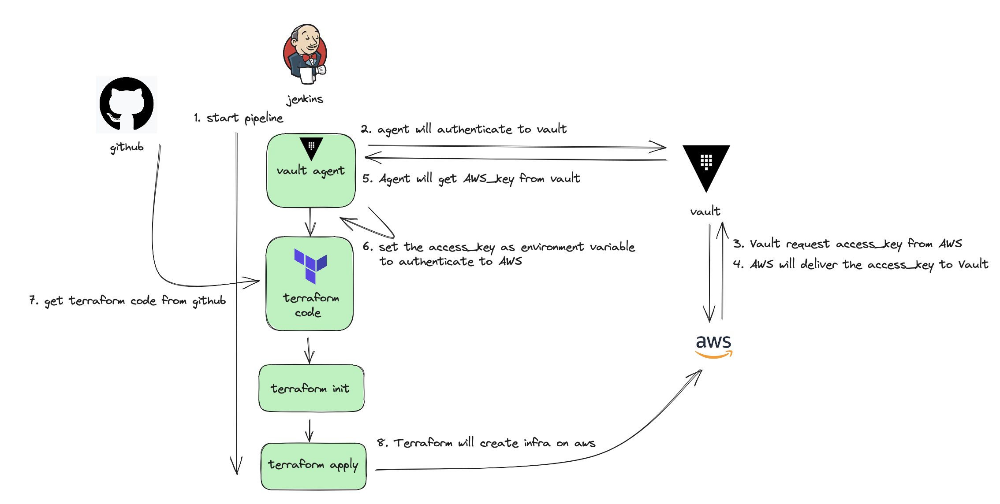

# Using Terraform on zenkins with Vault

### Intro 

You know the terraform is IaC which is configure infra on cloud but Using terraform only is not good choice because It just simple language that is not have apart deployment tool and It can used on CLI environment only without terraform enterprise

But enterprise is very expensive so I thought how to use well terraform and vault which is opensource version. The Answer is always mixed with other opensource software.

This demo will configure terraform CI/CD on zenkins and control the secrets which is used by configure cloud infra(ex. aws) on local macbook

Also Configuring jenkins, vault, terraform will be progress on the local macbook

### Architecture




### Requirement

1. terraform
2. vault
3. jenkins
4. gitgub account
5. macOS

6. AWS account which has next policy

   ```json
   
   ```


### Get Git

1. make working directroy

```bash
cd

mkdir vault_terraform_with_jenkins

cd ~/vault_terraform_with_jenkins

git clone 
```


### Start Vault

- we will use vault dev server which is supported by hashicorp

1. start vault dev server 
